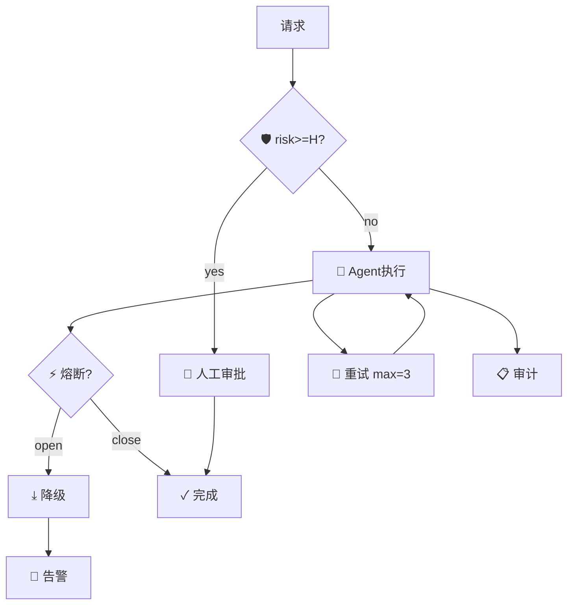

AUML·GLD 治理回环图：完整符号规范（v0.1）

> 本篇为「脑爆」笔记，是 AUML 七张图中的 **GLD（Governance & Loop Diagram，治理与回环图）** 的完整符号规范。GLD 是 AI 工作流"可控、可信、可恢复"的保障图，表达审批、人工干预、护栏、重试、降级、熔断与审计。

## 1. 用途与适用场景
- 为高风险/不可逆操作设计人工审批与兜底通道。
- 刻画失败重试、降级、熔断等"系统自愈"结构。
- 标注审计与告警，满足合规与可观测性要求。
- 与 WOD 配合：WOD 描述"正常编排"，GLD 描述"异常与治理"。

## 2. 节点符号表（Node Symbols）

| 符号 | 名称 | 类型 | 语义 | 必填属性 | 可选标注 |
|------|------|------|------|----------|----------|
| 👤 | Human | human | 审批/兜底 | role | risk |
| 🛡 | Guardrail | guardrail | 条件校验 | rule | — |
| ⚡ | CircuitBreaker | breaker | 熔断开/合 | threshold | open/close |
| ⤓ | Fallback | fallback | 异常兜底 | to | — |
| 🔁 | Retry | retry | 有限重试 | max | backoff |
| 📋 | Audit | audit | 日志/留痕 | — | retention |
| 🚨 | Alarm | alarm | 通知告警 | channel | severity |

## 3. 边符号表（Edge Symbols）

| 符号 | 文本语法 | 语义 |
|------|----------|------|
| ☑ | `A ☑ B` | 需人工审批 |
| ⤓ | `A ⤓ B` | 降级路径 |
| ↺ | `A ↺\|max=N\| B` | 重试/反思（带上限） |
| ⚡ | `A ⚡ B` | 熔断触发 |
| 🔒 | `A 🔒 B` | 合规校验 |

## 4. 标注体系（Annotation）
- `risk=H|M|L` 错误后果等级
- `threshold=...` 熔断阈值
- `max=N` 重试/循环上限
- `backoff=...` 退避策略
- `sla=...` 时限
- `channel=...` / `severity=...` 告警配置

## 5. 语义规则（Semantics / 静态校验）

1. **高风险兜底**：任意 `risk=H` 的节点或边，其后必须存在 Human 或 Fallback。
2. **重试有界**：Retry / 反思回环必须标注 `max>=1`，禁止无限循环。
3. **熔断闭环**：CircuitBreaker 须有 open/close 阈值，且熔断后必须存在降级或人工通道。
4. **可审计**：所有自动写操作（非只读 Tool）应接 Audit 节点。
5. **审批可追踪**：Human 审批节点应记录审批人角色与结果。

## 6. 示例 Mermaid

---
*配套：@flow 编译器已支持护栏/降级/回环结构；执行后端 auml_runtime.py 可 dry-run 含治理回路的工作流。*
